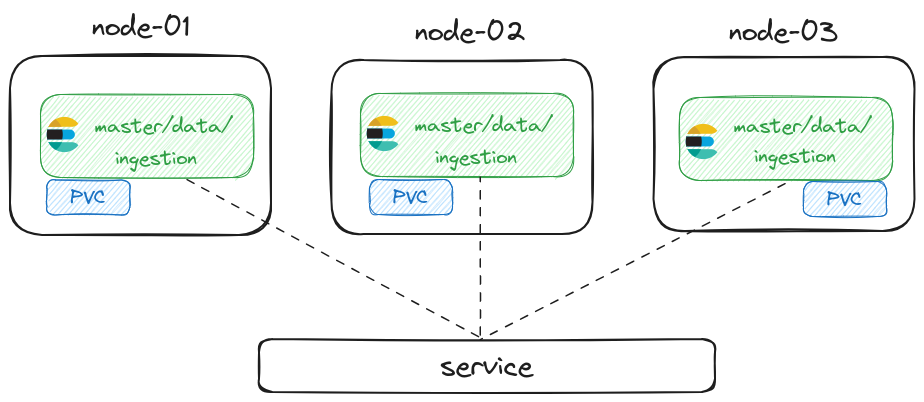

# Elasticsearch on Kubernetes

## Thought process

The first thing I did was to check the provided kube config file and connection to the cluster. With that done, I could start working on the solution and how to design it keeping in mind the requirements. 
I've also checked for how many nodes and how much resource each node has.

The first idea was to create a Helm Chart. I didn’t want to use the official Elastic Chart, since it’s not a maintained project anymore, neither the Bitnami one, 
mainly because they build their own container images and to my understanding it's not secure at all.

I started working on a Helm Chart for Elasticsearch while reading their official docs about [high availability](https://www.elastic.co/guide/en/elasticsearch/reference/current/high-availability-cluster-small-clusters.html#high-availability-cluster-design-three-nodes) 
and taking notes of what I would have to do. After a couple of hours, I had a Helm Chart working with minimum specs (StatefulSet with 3 Elasticsearch Pods) on the `feat/helm-chart` branch and faced an error about `vm.max_map_count`. 
I started googling for solutions and how to solve it and during that process, I’ve found the [ECK (Elastic Cloud on Kubernetes) project](https://github.com/elastic/cloud-on-k8s), which is a CRD maintained and supported by Elastic and I though “why not use Helm and ECK to create a great solution?”

Therefore, the Helm Chart can be versioned to support the running ECK version, for example:

- Chart version 1.0.0 could be used on Kubernetes clusters running ECK  ≥ 1.27
- Chart version 1.1.0 could be used on Kubernetes clusters running ECK ≥ 1.28

I also came up with a pros/cons table to clarify the decisions:

| Pros                                                                                                                                                                                                            | Cons                                                                                         |
|-----------------------------------------------------------------------------------------------------------------------------------------------------------------------------------------------------------------|----------------------------------------------------------------------------------------------|
| The Helm Chart could be versioned and hosted with [ChartMuseum](https://chartmuseum.com/).                                                                                                                                              | Infrastructure team will need to update both solutions regularly or when necessary.          |
| Make life easier for engineering teams and provide a great experience, since they only have to change the Helm values file to modify a configuration, deploy a new node or even a new component such as Kibana. | The upgrade process involves working on upgrading ECK and creating a new Helm Chart version. | 
| The upgrade process involves working on upgrading ECK and creating a new Helm Chart version.                                                                                                                    |                                                                                              | 

So I started working on this new Helm Chart on the `feat/eck-helm-chart` branch and since the Kubernetes cluster provided is running the 1.23 version, I had to use the [2.7 version of ECK](https://www.elastic.co/guide/en/cloud-on-k8s/2.7/k8s-quickstart.html).

The main idea was to abstract the `Elasticsearch` resource, as it offers everything we need out of the box, such as Pod Disruption Budget, Service, Persistent Volume Claim and more. 
As it can be highly customized, I've come up with an Elasticsearch template and every feature that could be customized can be done through the Helm values file.

## Architecture

All nodes are configured to use the same Elasticsearch roles: master, data and ingest. All data is stored in a persistent storage through a Persistent Volume Claim.

For resilience and high availability, Pod Disruption Budget and Update Strategy are used. For Pod Disruption Budget, a minimum of 2 nodes are required to be available at all times. 
For Update Strategy, 3 extra Pods can be scheduled when some configuration changes and new nodes replaces the existing ones, during these changes, only one node can be unavailable. 

The solution also supports secret injection to configure sensitive Elasticsearch settings.

And finally, the cluster API is exposed through a Service. The API is only accessible through the cluster or via `kubectl port-forward`.

> [!IMPORTANT]  
> Most of these configurations can be changed through the Helm values file. More on that on the next section.

## Deployment and usage

For deployment and usage, see [INSTRUCTIONS.md](./INSTRUCTIONS.md). 

## Scaling the solution

The solution was designed to meet the assignment requirements, but there are ways to support it on production leveraging features such as [Autoscaling](https://www.elastic.co/guide/en/cloud-on-k8s/2.7/k8s-autoscaling.html), 
[Advanced node scheduling](https://www.elastic.co/guide/en/cloud-on-k8s/2.7/k8s-advanced-node-scheduling.html) through Pod affinity and anti-affinity and 
[InitContainers](https://www.elastic.co/guide/en/cloud-on-k8s/2.7/k8s-init-containers-plugin-downloads.html) to support plugin downloads.

As mentioned earlier, both the CRDs and the Helm Chart could be deployed using a GitOps approach. The CRDs could be deployed as "day-0" app when bootstrapping a new cluster and the engineering teams could deploy the Helm Chart to create
their Elasticsearch cluster when needed.

## Final notes

As a personal note, I've remembered a lot of the time when I had to support a production Elasticsearch cluster running on EC2s. Good times!

I'm really satisfied with what I came up with and I hope you like it too. :) 

During the assignment, I relied a lot on the following docs:

- [Designing for resilience](https://www.elastic.co/guide/en/elasticsearch/reference/current/high-availability-cluster-design.html)
- [Deploy an Elasticsearch cluster](https://www.elastic.co/guide/en/cloud-on-k8s/2.7/k8s-deploy-elasticsearch.html)
- [Update Strategy](https://www.elastic.co/guide/en/cloud-on-k8s/2.7/k8s-update-strategy.html)
- [Volume Claim Templates](https://www.elastic.co/guide/en/cloud-on-k8s/2.7/k8s-volume-claim-templates.html)
- [Pod Disruption Budget](https://www.elastic.co/guide/en/cloud-on-k8s/2.7/k8s-pod-disruption-budget.html)
- [Elasticsearch Memory Mapping](https://www.elastic.co/guide/en/cloud-on-k8s/2.7/k8s-virtual-memory.html)
- [Pod PreStop hook](https://www.elastic.co/guide/en/cloud-on-k8s/2.7/k8s-prestop.html)
